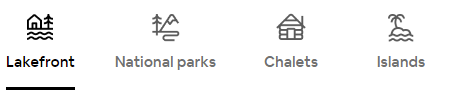
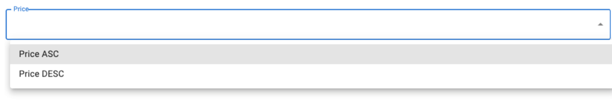

# RacingTeams' react-challange
*A simple React exercise to show us your skills!*

## Goal
The goal of this exercise is to reproduce the layout, style and functionalities of the [Airbnb's home page](https://www.airbnb.com).
The developed page should be as close as possible to the original one.

## Instructions
The following functionalities should be implemented:

- create a local small REST API to serve the data from the `data.json` file included in this repository.

- fetch the data and render it inside the cards as on the original Airbnb site.

- the card list should be filterable by “property_type” and sortable for price ASC/DESC.

## Assumptions:
- Use react
- Use [MaterialUI](https://mui.com/) with emotion or styled components. Use css only if strictly necessary.
- Use any tool / lib you need to.
- Publish your code into a public git repository.

## Tips 
- The filtering section could be similar to the following

You are free to choose the icons you like.
The `property_type`used to filter can be hardcoded client side. Not more than one filter at time should be enabled.   

- The sorting section could be similar to the following

- When a card is clicked the related info should be printed in the console log.

- No other functionalities are required, but any further functionality implementation is a plus. 
Every assumption not specificaly stated is on you.

## Evaluation
The following arguments will be matter of evaluation and further discussion during the technical interview:
- Code cleanness
- Code structure and project organization
- Correct use of modern React
- Code readability
- Styling of the resulting web page
- Significant additional functionalities implemented

